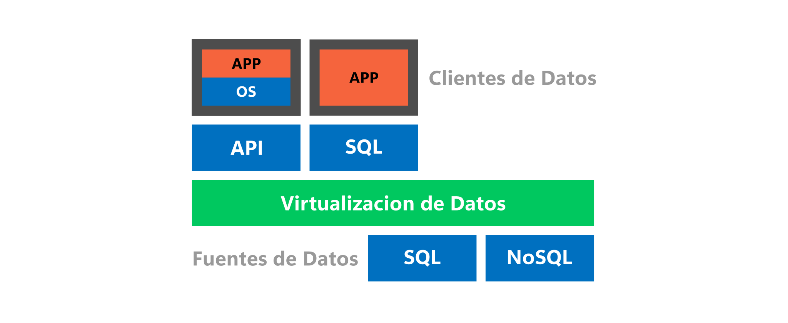
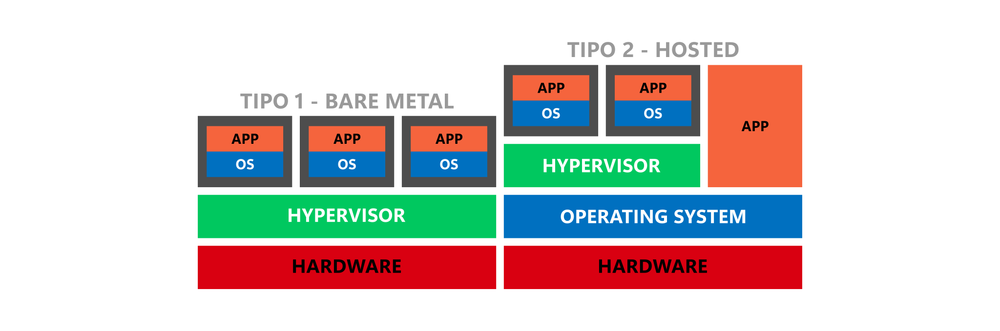

# Sistemas operacionales

<code>Fundamentos de sistemas operativos</code>

Creado por <code>Giancarlo Ortiz</code> para explicar los fundamentos de los <code>Sistemas operativos</code>

## Virtualización
La virtualización utiliza software para imitar las características de un componente de un sistema informático y crear un entorno virtual que provea una solución similar al componente real.

## Agenda
1. [Virtualización de datos](#1-virtualización-de-datos).
1. [Virtualización de hardware](#1-virtualización-de-hardware).
1. [virtualización de software](#2-contenerización).
1. [virtualización de infraestructura](#2-contenerización).

 

---
# 1. Virtualización de datos
La [virtualización de datos][1_0] Consiste en integrar datos de fuentes dispersas, en distintas localizaciones y formatos, sin replicar los datos, para construir una capa de datos virtual que facilita la provisión de servicios de datos unificados para dar soporte a múltiples aplicaciones y usuarios.

* ><i>"Siempre encuentro a la gente más inteligente que yo. Entonces mi trabajo es asegurarme de que la gente inteligente pueda trabajar junta. Y es que la gente estúpida puede trabajar junta fácilmente, la gente inteligente no."</i> 
<cite style="display:block; text-align: right">[Jack Ma](https://es.wikipedia.org/wiki/Jack_Ma)</cite>

[1_0]:https://es.wikipedia.org/wiki/Virtualizaci%C3%B3n_de_datos

## 1.1. Características ✔
* Es una tecnología de integración de datos.
* Normaliza fuentes de datos heterogéneas.
* Ofrece la capacidad de aprovechar grandes volúmenes de datos.
* Permite al usuario manipular los datos en tiempo real.

## 1.2. Diagrama de capas ✔

<small>Papers: 
1: [Cevallos Zhunio, J., Noboa Franco, G., Valle Chiriboga, C., & Rodriguez Ve-
lasquez, P. (2020). Virtualización de datos una alternativa moderna de integración de datos. RECIMUNDO](https://dialnet.unirioja.es/descarga/articulo/7591598.pdf)
</small>

# 2. Virtualización de hardware
Un [hipervisor][2_0] o monitor de máquina virtual, [VM][2_1]; es una capa de software que permite realizar virtualización a nivel de hardware y utilizar, al mismo tiempo, diferentes sistemas operativos compartiendo los mismos recursos de hardware de una computadora.

* ><i>"Puedes tener la mejor tecnología, puedes tener el mejor modelo de negocio, pero si no sabes cómo contar tu historia; nada de eso importará. Nadie te verá."</i> 
<cite style="display:block; text-align: right">[Jeff Bezos](https://es.wikipedia.org/wiki/Jeff_Bezos)</cite>

[2_0]:https://es.wikipedia.org/wiki/Hipervisor
[2_1]:https://es.wikipedia.org/wiki/M%C3%A1quina_virtual

## 2.1. Arquitectura ✔
* El [__Host__][21_1] o anfitrión es la máquina utilizada por el hipervisor.
* El [__Guest__][21_1] o máquina invitada es la máquina virtual.
* La [__Asistencia por hardware__][21_3] mejora la eficiencia.
* Las [__Instantáneas__][21_4] o copias temporal del estado del sistema.

[21_1]:https://es.wikipedia.org/wiki/Host
[21_2]:https://es.wikipedia.org/wiki/M%C3%A1quina_virtual
[21_3]:https://es.wikipedia.org/wiki/Virtualizaci%C3%B3n_x86#Soporte_hardware
[21_4]:https://es.wikipedia.org/wiki/Copia_instant%C3%A1nea_de_volumen

## 2.2. Características ✔
* Permite alojar distintas maquinas virtuales o [VM][2_1].
* Permite el despliegue de entornos seguros de ejecución.
* Permite reducir costos y simplificar la gestión.
* Permite la ampliación dinámica de las capacidades del hardware.
* Permite La migración de instantáneas mejora la fiabilidad. 

## 2.2 Tipos de Hipervisor ✔
* [__Virtualización nativa:__][22_1] mejor rendimiento porque el hipervisor se ejecuta directamente sobre el hardware físico.
* [__Virtualización alojada:__][22_2] mejor compatibilidad porque el hipervisor se ejecuta sobre un sistema operativo anfitrión.

[22_1]:https://es.wikipedia.org/wiki/Hipervisor#Hipervisor_tipo_1
[22_2]:https://es.wikipedia.org/wiki/Hipervisor#Hipervisor_tipo_2

## 2.3 Diagrama de capas ✔

<small>Papers: 
1: [Fernandez, R. J. (2015). Comparación de performance de Hipervisores.](https://rdu.iua.edu.ar/bitstream/123456789/629/1/TF_Rodrigo%20Fernandez.pdf)
2: [Bermejo, B., & Juiz, C. (2022). A general method for evaluating the overhead when consolidating servers: performance degradation in virtual machines and containers. The Journal of Supercomputing, 1-28.](https://link.springer.com/content/pdf/10.1007/s11227-022-04318-5.pdf)
</small>

## 2.3. Ejemplos de Hipervisor ✔
| Tipo 1 | Tipo 2 |
|:---:|:---:|
| [Hyper-V][23_1] | [Qemu][23_2] |
| [VMware ESXi][23_3] | [Vmware][23_4] |
| [Proxmox VE][23_5] | [Parallels][23_6] |
| [Xen][23_7] | [VirtualBox][23_8] |

[23_1]:https://es.wikipedia.org/wiki/Hyper-V
[23_2]:https://en.wikipedia.org/wiki/QEMU
[23_3]:https://en.wikipedia.org/wiki/VMware_ESXi
[23_4]:https://en.wikipedia.org/wiki/VMware_Workstation
[23_5]:https://es.wikipedia.org/wiki/Proxmox_Virtual_Environment
[23_6]:https://en.wikipedia.org/wiki/Parallels_Server_for_Mac
[23_7]:https://es.wikipedia.org/wiki/Xen
[23_8]:https://en.wikipedia.org/wiki/VirtualBox

# 3. Virtualización de software
Un motor de contenedores o [CT][3_0] es una capa de software que permite realizar una virtualización a nivel de software y utilizar diferentes y aislados espacios de usuario compartiendo los mismos recursos de una aplicación o sistema operativo.

* ><i>"Los servidores físicos, privados o públicos son irrelevantes para el usuario final, Las nubes hin¡bridas se están convirtiendo en la solución predeterminada."</i> 
<cite style="display:block; text-align: right">[Paul Cormier](https://en.wikipedia.org/wiki/Paul_Cormier_(engineer))</cite>

[3_0]:https://es.wikipedia.org/wiki/Hipervisor

## 3.1. Características ✔
* Permite alojar distintos contenedores o [CT][3_0].
* Los [CT][3_0] pueden parecer computadoras reales, pero es una capa mas ligera.
* Aislá aplicaciones del SO subyacente y de aplicaciones.
* Posibilita las migraciones en vivo pueden ser utilizadas para realizar balanceo de carga

## 2.2 Tipos de Hipervisor ✔
* Virtualización a nivel de sistema operativo.
* Virtualización de escritorio
* Virtualización de aplicaciones.
* Virtualización de servicios.

## 3.3. Diagrama de capas ✔

<small>Papers: 
1: [Espinosa Tigre, Rodolfo Moisés. (2019). Análisis comparativo de un hipervisor nativo propietario y libre como alternativa de solución para el proceso de almacenamiento de datos. Escuela Superior Politécnica de Chimborazo. Riobamba.](http://dspace.espoch.edu.ec/bitstream/123456789/10832/1/20T01201.pdf)
</small>

## 3.4. Ejemplos de Motores de contenedores ✔
* [Docker](https://es.wikipedia.org/wiki/Docker_(software))
* [Kubernetes](https://es.wikipedia.org/wiki/Kubernetes)
* [OpenShift](https://es.wikipedia.org/wiki/OpenShift)

---
aislados o [contenedores][11_1] donde las aplicaciones de software pueden ejecutarse con seguridad 
 sistemas operativos sin modificar en una misma computadora.
Un [Contenedor][] es un espacio de usuario aislado 
es una virtualización a nivel de sistema operativo o a nivel de aplicación sobre múltiples recursos de red para q en espacios de contenedores en cualquier entorno de nube o no nube, independientemente del tipo o proveedor.

---
## Mas Recursos
- [Emulador](https://es.wikipedia.org/wiki/Emulador) (Wikipedia)
- [Simulador](https://es.wikipedia.org/wiki/Simulador) (Wikipedia)
- [Computación en la nube](https://es.wikipedia.org/wiki/Computaci%C3%B3n_en_la_nube) (Wikipedia)
- [Amazon EC2](https://es.wikipedia.org/wiki/Amazon_EC2) (Wikipedia)
- [Microsoft Azure VM](https://es.wikipedia.org/wiki/Microsoft_Azure) (Wikipedia)
- [Alibaba Cloud ECS](https://en.wikipedia.org/wiki/IBM_Cloud) (Wikipedia)
- [Google Compute Engine](https://en.wikipedia.org/wiki/Google_Compute_Engine) (Wikipedia)
- [IBM Cloud VS](https://en.wikipedia.org/wiki/IBM_Cloud) (Wikipedia)
- [Oracle Cloud VM](https://es.wikipedia.org/wiki/Oracle_Cloud) (Wikipedia)