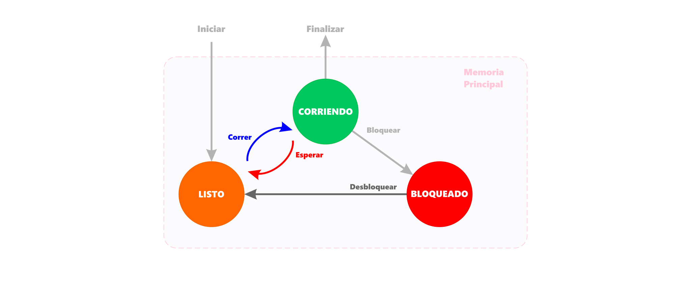

# Sistemas operacionales

<code>Fundamentos de sistemas operativos</code>

Creado por <code>Giancarlo Ortiz</code> para explicar los fundamentos de los <code>Sistemas operativos</code>

## Clasificación
Un sistema operativo (SO) es un conjunto de programas o software destinado a permitir la comunicación del usuario con un ordenador y gestionar sus recursos de manera cómoda y eficiente. Comienza a trabajar cuando se enciende el ordenador, y gestiona el hardware de la máquina desde los niveles más básicos. (Wikipedia).

## Agenda
1. [Clasificación de Sistemas operativos](#1-clasificación-so).
1. [Windows 10 - caso de estudio](#2-windows-10).
1. [GNU/Linux - Caso de estudio](#3-kde-neon).
1. [macOS - Caso de estudio](#4-macos).

 

---
# 1. Clasificación SO
La [virtualización de datos][1_0] Consiste en integrar datos de fuentes dispersas, en distintas localizaciones y formatos, sin replicar los datos, para construir una capa de datos virtual que facilita la provisión de servicios de datos unificados para dar soporte a múltiples aplicaciones y usuarios.

* ><i>"Siempre encuentro a la gente más inteligente que yo. Entonces mi trabajo es asegurarme de que la gente inteligente pueda trabajar junta. Y es que la gente estúpida puede trabajar junta fácilmente, la gente inteligente no."</i> 
<cite style="display:block; text-align: right">[Jack Ma](https://es.wikipedia.org/wiki/Jack_Ma)</cite>

[1_0]:https://es.wikipedia.org/wiki/Virtualizaci%C3%B3n_de_datos

## 1.1. Por el número de usuarios ✔
Los sistemas operativos de un solo usuario no tienen funciones para distinguir a los usuarios, pero pueden permitir que varios programas se ejecuten en tándem . [8] Un sistema operativo multiusuario amplía el concepto básico de multitarea con funciones que identifican procesos y recursos, como el espacio en disco, que pertenecen a varios usuarios, y el sistema permite que varios usuarios interactúen con el sistema al mismo tiempo

* [Mono-usuarios][11_1]
* [Multi-usuarios][11_2]
* [Multi-acceso][11_3]
* [Multi-estación][11_4]

[11_1]:https://es.wikipedia.org/wiki/Monousuario
[11_2]:https://es.wikipedia.org/wiki/Multiusuario
[11_3]:https://es.wikipedia.org/wiki/Multiacceso
[11_4]:https://es.wikipedia.org/wiki/Multiestaci%C3%B3n

## 1.2. Por el número de tareas [(procesos)][12_01] ✔
Un sistema de una sola tarea solo puede ejecutar un programa a la vez, mientras que un sistema operativo multi-tarea permite que más de un programa se ejecute al mismo tiempo.

* [Mono-tarea][12_1]
* [Multi-tarea cooperativa][12_2]
* [Multi-tarea apropiativa][12_3]
* [Multi-tarea real][12_5]

## 1.2.1. Por el número de hilos [(sub-procesos)][12_02] ✔
* [Mono-hilo][12_1]
* [Multi-hilo][12_4]

[12_01]:https://es.wikipedia.org/wiki/Proceso_(inform%C3%A1tica)#
[12_02]:https://es.wikipedia.org/wiki/Hilo_(inform%C3%A1tica)#
[12_1]:https://es.wikipedia.org/wiki/Monotarea
[12_2]:https://es.wikipedia.org/wiki/Multitarea_cooperativa
[12_3]:https://es.wikipedia.org/wiki/Multitarea_apropiativa
[12_4]:https://es.wikipedia.org/wiki/Multihilo
[12_5]:https://es.wikipedia.org/wiki/Multitarea#Real

## 1.3. Por el número de procesadores ✔
* [Mono-procesador][13_1]
* [Multi-procesamiento simétrico][13_2]
* [Multi-procesamiento asimétrico][13_3]
* [NUMA][13_4]

[13_1]:https://es.wikipedia.org/wiki/Monoprocesador
[13_2]:https://es.wikipedia.org/wiki/Multiprocesamiento_sim%C3%A9trico
[13_3]:https://en.wikipedia.org/wiki/Asymmetric_multiprocessing
[13_4]:https://es.wikipedia.org/wiki/NUMA

## 1.4. Por el tipo de núcleo ✔
* [De Nano-núcleo][14_1]
* [De Exo-núcleo][14_2]
* [De Micro-núcleo][14_3]
* [De Núcleo Monolítico][14_4]
* [De Núcleo híbrido][14_5]

[14_1]:https://en.wikipedia.org/wiki/Microkernel#Nanokernel
[14_2]:https://en.wikipedia.org/wiki/Exokernel
[14_3]:https://es.wikipedia.org/wiki/Micron%C3%BAcleo
[14_4]:https://es.wikipedia.org/wiki/N%C3%BAcleo_monol%C3%ADtico
[14_5]:https://es.wikipedia.org/wiki/N%C3%BAcleo_h%C3%ADbrido

## 1.5. Por el tipo de cliente ✔
* [De cliente liviano][15_1]
* [De cliente pesado][15_2]
* [De cliente híbrido][15_3]

[15_1]:https://es.wikipedia.org/wiki/Cliente_liviano
[15_2]:https://es.wikipedia.org/wiki/Cliente_pesado
[15_3]:https://es.wikipedia.org/wiki/Cliente_h%C3%ADbrido

## 1.6. Por la ubicación de los recursos ✔
* [Sistema operativo distribuido][16_1]
* [Sistema operativo de mainframes][16_2]

[16_1]:https://en.wikipedia.org/wiki/Distributed_operating_system
[16_2]:https://es.wikipedia.org/wiki/Unidad_central

## 1.4. Por el propósito ✔
* [Sistema operativo de propósito general][13_1]
* [Sistema operativo de servidor][13_4]
* [Sistema operativo de estación de trabajo][13_2]
* [Sistema operativo de teléfono inteligente][13_3]
* [Sistema operativo embebido][13_6]
* [Sistema operativo de tiempo real][13_7]

[13_1]:https://es.wikipedia.org/wiki/Estaci%C3%B3n_de_trabajo
[13_2]:https://es.wikipedia.org/wiki/Estaci%C3%B3n_de_trabajo
[13_3]:https://es.wikipedia.org/wiki/Tel%C3%A9fono_inteligente
[13_4]:https://es.wikipedia.org/wiki/Servidor
[13_6]:https://es.wikipedia.org/wiki/Sistema_operativo_embebido
[13_7]:https://es.wikipedia.org/wiki/Sistema_operativo_de_tiempo_real

# 2. Windows 11
* Versión: [Windows 11 21H2][2_0]
* Núcleo: híbrido ([NT kernel][2_1])
* API: [WinAPI][2_2]
* GUI: [Windows shell][2_3]
* Framework: [.NET][2_4]

[2_0]:https://en.wikipedia.org/wiki/Windows_11
[2_1]:https://en.wikipedia.org/wiki/Architecture_of_Windows_NT
[2_2]:https://en.wikipedia.org/wiki/Windows_API
[2_3]:https://en.wikipedia.org/wiki/Windows_shell
[2_4]:https://en.wikipedia.org/wiki/.NET_Framework

# 3. KDE neon
* Versión: [KDE neon 5.24][3_0]
* Núcleo: monolítico ([Linux][3_1])
* API: [Linux API][3_2]
* GUI: [Plasma 5][3_3]
* Framework: [Qt][3_4]

[3_0]:https://en.wikipedia.org/wiki/KDE_neon
[3_1]:https://en.wikipedia.org/wiki/Linux_kernel
[3_2]:https://en.wikipedia.org/wiki/Linux_kernel_interfaces
[3_3]:https://es.wikipedia.org/wiki/KDE_Plasma_5
[3_4]:https://en.wikipedia.org/wiki/Qt_(software)#

# 4. Ubuntu
* Versión: [Jammy Jellyfish][4_0]
* Núcleo: monolítico ([Linux][4_1])
* API: [Linux API][4_2]
* GUI: [Gnome][4_3]
* Framework: [GTK][4_4]

[4_0]:https://en.wikipedia.org/wiki/Ubuntu
[4_1]:https://en.wikipedia.org/wiki/Linux_kernel
[4_2]:https://en.wikipedia.org/wiki/Linux_kernel_interfaces
[4_3]:https://en.wikipedia.org/wiki/GNOME
[4_4]:https://en.wikipedia.org/wiki/GTK

# 5. macOS
* Versión: [Monterey 12.2][5_0]
* Núcleo: híbrido ([XNU][5_1])
* API: [SUS][5_2]
* GUI: [Aqua][5_3]
* Framework: [Cocoa][5_4]

[5_0]:https://en.wikipedia.org/wiki/MacOS_Monterey
[5_1]:https://en.wikipedia.org/wiki/XNU
[5_2]:https://en.wikipedia.org/wiki/Single_UNIX_Specification
[5_3]:https://en.wikipedia.org/wiki/Aqua_(user_interface)#
[5_4]:https://en.wikipedia.org/wiki/Cocoa_(API)#

---
## Mas Recursos
- [Debate Tanenbaum–Torvalds](https://es.wikipedia.org/wiki/Debate_Tanenbaum%E2%80%93Torvalds) (Wikipedia)
- [Micro-kernel o Monolitivo ](https://www.xataka.com/historia-tecnologica/linux-esta-obsoleto-historia-detras-declaracion-que-provoco-debate-apasionante-acerca-este-sistema-operativo-1) (XATAKA)
- [Computadoras paralelas](https://es.wikipedia.org/wiki/Computaci%C3%B3n_paralela#Clases_de_computadoras_paralelas) (Wikipedia)
- [Concurrencia](https://es.wikipedia.org/wiki/Concurrencia_(inform%C3%A1tica)) (Wikipedia)