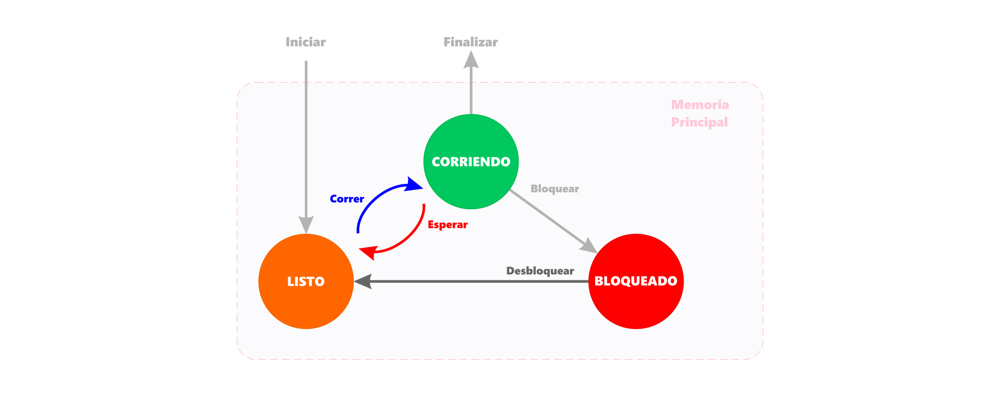
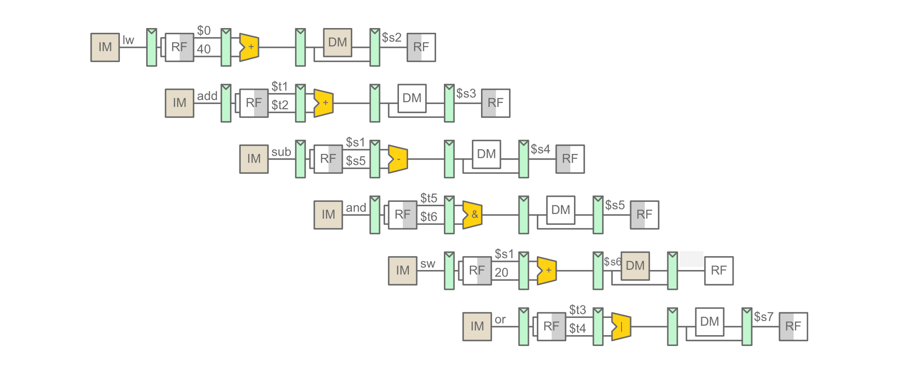
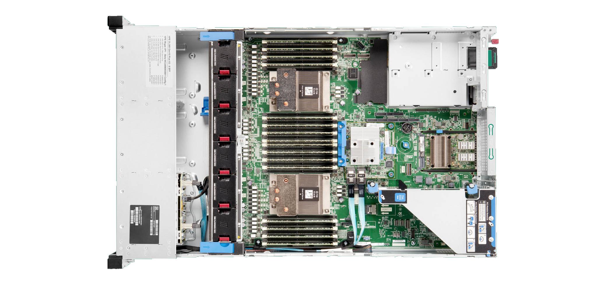
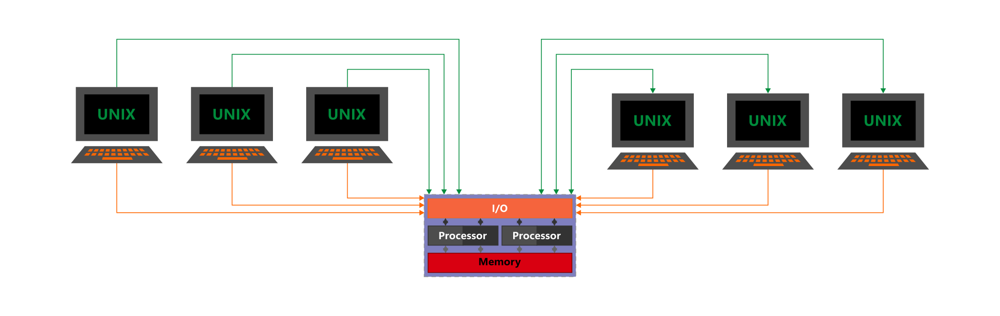
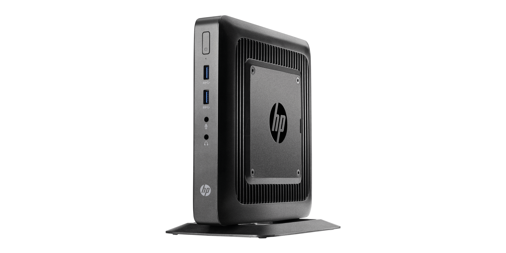
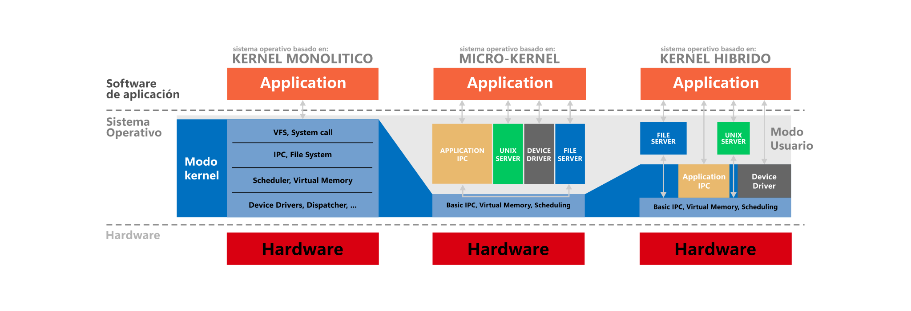
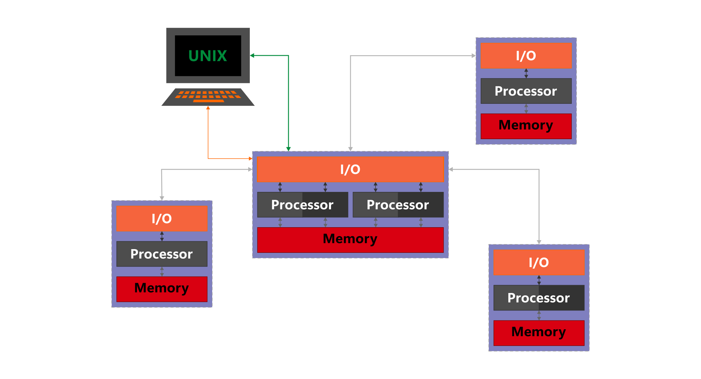
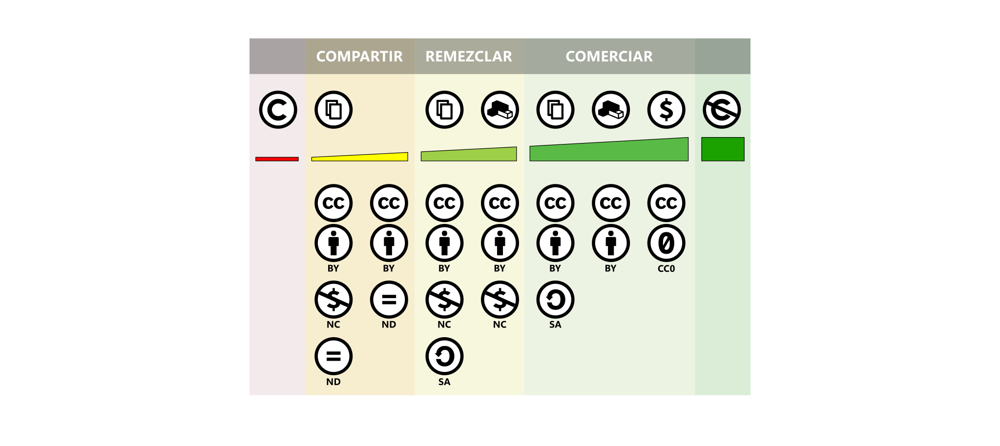

# Sistemas operacionales

<code>Fundamentos de sistemas operativos</code>

Creado por <code>Giancarlo Ortiz</code> para explicar los fundamentos de los <code>Sistemas operativos</code>

## Clasificación de sistemas Operativos
Un SO es un conjunto de programas destinados a permitir la comunicación del usuario con el sistema cuando se enciende y ayuda gestionar sus recursos de hardware de manera cómoda y eficiente, por tanto sus caracteristicas están relacionadas con el hardware asociado.

## Agenda
1. [Clasificación por tipo de hardware](#1-clasificación-por-tipo-de-hardware).
1. [Clasificación por tipo de usuarios](#2-clasificación-por-tipo-de-usuarios).
1. [Clasificación por su estructura](#3-clasificación-por-su-estructura).
1. [Clasificación por derechos de autor](#4-clasificación-por-derechos-de-autor).

 

---
# 1. Clasificación por tipo de hardware
Un SO es un conjunto de programas destinados a permitir la comunicación del usuario con el sistema cuando se enciende y ayuda gestionar sus recursos de hardware de manera cómoda y eficiente, por tanto sus caracteristicas están relacionadas con el hardware asociado.

* ><i>"Si hubiera un concurso para hallar el lenguaje ensamblador más incomprensible del mundo;  el SPARC sería uno de los favoritos."</i> 
<cite style="display:block; text-align: right">[Andrew S. Tanenbaum](https://es.wikipedia.org/wiki/Andrew_S._Tanenbaum)</cite>

## 1.1. Por el número de tareas [(procesos)][11_0] ✔
Un sistema de una sola tarea solo puede ejecutar un programa a la vez, mientras que un sistema operativo multi-tarea permite que más de un programa se ejecute al mismo tiempo.

* [Mono-tarea][11_1].
* [Multi-tarea cooperativa][11_2].
* [Multi-tarea apropiativa][11_3].
* [Multi-tarea real][11_4].

[11_0]:https://es.wikipedia.org/wiki/Proceso_(inform%C3%A1tica)#
[11_1]:https://es.wikipedia.org/wiki/Monotarea
[11_2]:https://es.wikipedia.org/wiki/Multitarea_cooperativa
[11_3]:https://es.wikipedia.org/wiki/Multitarea_apropiativa
[11_4]:https://es.wikipedia.org/wiki/Multitarea#Real

## 1.2. Por el número de hilos [(sub-procesos)][12_0] ✔
Un sistema multi-hilo tiene soporte por hardware para ejecutar eficientemente múltiples hilos de ejecución de uno o varios procesos al mismo tiempo.

* [Mono-hilo][12_1].
* [Multi-hilo][12_2].

[12_0]:https://es.wikipedia.org/wiki/Hilo_(inform%C3%A1tica)#
[12_1]:https://es.wikipedia.org/wiki/Hilo_(inform%C3%A1tica)#
[12_2]:https://es.wikipedia.org/wiki/Multihilo

## 1.3. Por el número de procesadores ✔
Un sistema de un solo procesador no puede ejecutar multi-tarea real, mientras que un sistema multi-procesador permite multi-tarea real y compartir recursos de memoria con otros procesadores.

* [Mono-procesador][13_1].
* [Multi-procesamiento simétrico][13_2].
* [Multi-procesamiento asimétrico][13_3].
* [NUMA][13_4].

[13_1]:https://es.wikipedia.org/wiki/Monoprocesador
[13_2]:https://es.wikipedia.org/wiki/Multiprocesamiento_sim%C3%A9trico
[13_3]:https://en.wikipedia.org/wiki/Asymmetric_multiprocessing
[13_4]:https://es.wikipedia.org/wiki/NUMA

# 2. Clasificación por tipo de usuarios
Un SO multi-usuario amplía el concepto básico de multi-tarea con funciones que identifican procesos y recursos, con un espacio de usuario, de manera que incorpora funcionalidad para distinguir varios tipos de usuarios y puede asignarles los recursos necesarios o permitidos de distinta manera.

* ><i>"Si la gente no piensa que las matemáticas son simples;  es solo porque no se dan cuenta de lo complicada que es la vida."</i> 
<cite style="display:block; text-align: right">[John von Neumann](https://es.wikipedia.org/wiki/John_von_Neumann)</cite>

## 2.1. Por el número de usuarios ✔
Un sistema multi-usuario identifica procesos y recursos, con un espacio de usuario, mientras que un sistema multi-acceso permite que varios usuarios interactúen con el sistema al mismo tiempo.

* [Mono-usuarios][21_1].
* [Multi-usuarios][21_2].
* [Multi-acceso][21_3].
* [Multi-estación][21_4].

[21_1]:https://es.wikipedia.org/wiki/Monousuario
[21_2]:https://es.wikipedia.org/wiki/Multiusuario
[21_3]:https://es.wikipedia.org/wiki/Multiacceso
[21_4]:https://es.wikipedia.org/wiki/Multiestaci%C3%B3n

## 2.2. Por su capacidad de procesamiento ✔
Un sistema de cliente liviano se apoya en el servidor para las tareas de procesamiento, y se enfoca principalmente en transportar la entrada y la salida entre el usuario y el servidor remoto; mientras que un cliente pesado ejecuta la mayor carga de cómputo

* [Sistema operativo de servidor][22_1].
* [Sistema operativo de cliente liviano][22_2].
* [Sistema operativo de cliente pesado][22_3].
* [Sistema operativo de cliente híbrido][22_4].

[22_1]:https://es.wikipedia.org/wiki/Servidor
[22_2]:https://es.wikipedia.org/wiki/Cliente_liviano
[22_3]:https://es.wikipedia.org/wiki/Cliente_pesado
[22_4]:https://es.wikipedia.org/wiki/Cliente_h%C3%ADbrido

## 2.3. Por el propósito ✔
* [Sistema operativo de propósito general][23_1]
* [Sistema operativo de estación de trabajo][23_2]
* [Sistema operativo de teléfono inteligente][23_3]
* [Sistema operativo embebido][23_6]
* [Sistema operativo de tiempo real][23_7]

[23_1]:https://es.wikipedia.org/wiki/Estaci%C3%B3n_de_trabajo
[23_2]:https://es.wikipedia.org/wiki/Estaci%C3%B3n_de_trabajo
[23_3]:https://es.wikipedia.org/wiki/Tel%C3%A9fono_inteligente

[23_6]:https://es.wikipedia.org/wiki/Sistema_operativo_embebido
[23_7]:https://es.wikipedia.org/wiki/Sistema_operativo_de_tiempo_real

# 3. Clasificación por su estructura
Un SO es complejo y solo puede entenderse dividiendo su operación en módulos, de forma que cada según el propósito del sistema pueda incluir una o mas piezas funcionales.

* ><i>"La ciencia es una ecuación diferencial;  la religión es una condición de frontera."</i> 
<cite style="display:block; text-align: right">[Alan Turing](https://es.wikipedia.org/wiki/Alan_Turing)</cite>

## 3.1. Por el tipo de núcleo ✔
Un sistema puede restringir el modo protegido a pocos o muchos componentes y de ello dependerá su clasificación.

* [De Nano-núcleo][31_1]
* [De Exo-núcleo][31_2]
* [De Micro-núcleo][31_3]
* [De Núcleo Monolítico][31_4]
* [De Núcleo híbrido][31_5]

[31_1]:https://en.wikipedia.org/wiki/Microkernel#Nanokernel
[31_2]:https://en.wikipedia.org/wiki/Exokernel
[31_3]:https://es.wikipedia.org/wiki/Micron%C3%BAcleo
[31_4]:https://es.wikipedia.org/wiki/N%C3%BAcleo_monol%C3%ADtico
[31_5]:https://es.wikipedia.org/wiki/N%C3%BAcleo_h%C3%ADbrido

## 3.2. Por la ubicación de los recursos ✔
* [Sistema operativo distribuido][32_1]
* [Sistema operativo de mainframes][32_2]

[32_1]:https://en.wikipedia.org/wiki/Distributed_operating_system
[32_2]:https://es.wikipedia.org/wiki/Unidad_central

# 4. Clasificación por derechos de autor
* [**Copyright:**](https://es.wikipedia.org/wiki/Derecho_de_autor) licencias de software que se reservan los derechos patrimoniales y otorgan derechos de utilización bajo distintos modelos comerciales.
* [**Copyleft:**](https://es.wikipedia.org/wiki/Copyleft) licencias de software relacionadas con mantener libres los derechos patrimoniales y de utilización.
* [**Código abierto:**](https://es.wikipedia.org/wiki/Licencia_de_c%C3%B3digo_abierto) licencias que permiten que tanto el código fuente como los archivos binarios del software sean modificados y redistribuidos libremente favoreciendo la colaboración abierta.
* [**Dominio público:**](https://es.wikipedia.org/wiki/Dominio_p%C3%BAblico) obras y aplicaciones informáticas  que no tienen derechos exclusivos de autor, pertenecen a todos.

# 4.1. Licencias de código abierto
Una licencia es un documento que otorga derechos extensivos para redistribuir, modificar y/o comercializar una obra; algunos ejemplos de las licencias mas populares:

* [APACHE](https://es.wikipedia.org/wiki/Apache_License)
* [GPL](https://es.wikipedia.org/wiki/GNU_General_Public_License) y [LGPL](https://es.wikipedia.org/wiki/GNU_Lesser_General_Public_License)
* [MIT](https://es.wikipedia.org/wiki/Licencia_MIT)
* [CC](https://en.wikipedia.org/wiki/Creative_Commons_license)

# 4.2. Licencias CC
* (CC BY)
* (CC BY-SA)
* (CC BY-ND)
* (CC BY-NC)
* (CC BY-NC-SA)
* (CC BY-NC-ND)

---
## Mas Recursos
- [Debate Tanenbaum–Torvalds](https://es.wikipedia.org/wiki/Debate_Tanenbaum%E2%80%93Torvalds) (Wikipedia)
- [Micro-kernel o Monolitivo](https://www.xataka.com/historia-tecnologica/linux-esta-obsoleto-historia-detras-declaracion-que-provoco-debate-apasionante-acerca-este-sistema-operativo-1) (XATAKA)
- [Computadoras paralelas](https://es.wikipedia.org/wiki/Computaci%C3%B3n_paralela#Clases_de_computadoras_paralelas) (Wikipedia)
- [Concurrencia](https://es.wikipedia.org/wiki/Concurrencia_(inform%C3%A1tica)) (Wikipedia)