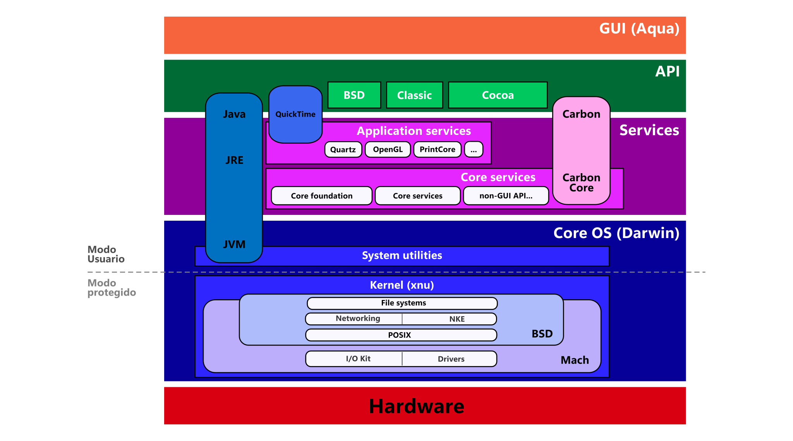

# Sistemas operacionales

<code>Fundamentos de sistemas operativos</code>

Creado por <code>Giancarlo Ortiz</code> para explicar los fundamentos de los <code>Sistemas operativos</code>

## Tipos de sistemas Operativos
Un SO es un conjunto de programas destinados a permitir la comunicación del usuario con el sistema cuando se enciende y ayuda gestionar sus recursos de hardware de manera cómoda y eficiente, por tanto sus caracteristicas están relacionadas con el hardware asociado.

## Agenda
1. [Núcleo Linux](#1-ubuntu-server).
1. [Derivaciones](#1-ubuntu-server).
1. [Versiones](#2-windows-10).
1. [Distribuciones](#3-kde-neon).

 

---
# 1. Núcleo de Linux

# 2. Windows 11
* Versión: [Windows 11 21H2][2_0]
* Núcleo: híbrido ([NT kernel][2_1])
* API: [WinAPI][2_2]
* GUI: [Windows shell][2_3]
* Framework: [.NET][2_4]

[2_0]:https://en.wikipedia.org/wiki/Windows_11
[2_1]:https://en.wikipedia.org/wiki/Architecture_of_Windows_NT
[2_2]:https://en.wikipedia.org/wiki/Windows_API
[2_3]:https://en.wikipedia.org/wiki/Windows_shell
[2_4]:https://en.wikipedia.org/wiki/.NET_Framework

# 3. KDE neon
* Versión: [KDE neon 5.24][3_0]
* Núcleo: monolítico ([Linux][3_1])
* API: [Linux API][3_2]
* GUI: [Plasma 5][3_3]
* Framework: [Qt][3_4]

[3_0]:https://en.wikipedia.org/wiki/KDE_neon
[3_1]:https://en.wikipedia.org/wiki/Linux_kernel
[3_2]:https://en.wikipedia.org/wiki/Linux_kernel_interfaces
[3_3]:https://es.wikipedia.org/wiki/KDE_Plasma_5
[3_4]:https://en.wikipedia.org/wiki/Qt_(software)#

# 4. Ubuntu
* Versión: [Jammy Jellyfish][4_0]
* Núcleo: monolítico ([Linux][4_1])
* API: [Linux API][4_2]
* GUI: [Gnome][4_3]
* Framework: [GTK][4_4]

[4_0]:https://en.wikipedia.org/wiki/Ubuntu
[4_1]:https://en.wikipedia.org/wiki/Linux_kernel
[4_2]:https://en.wikipedia.org/wiki/Linux_kernel_interfaces
[4_3]:https://en.wikipedia.org/wiki/GNOME
[4_4]:https://en.wikipedia.org/wiki/GTK

# 5. macOS
* Versión: [Monterey 12.2][5_0]
* Núcleo: híbrido ([XNU][5_1])
* API: [SUS][5_2]
* GUI: [Aqua][5_3]
* Framework: [Cocoa][5_4]

[5_0]:https://en.wikipedia.org/wiki/MacOS_Monterey
[5_1]:https://en.wikipedia.org/wiki/XNU
[5_2]:https://en.wikipedia.org/wiki/Single_UNIX_Specification
[5_3]:https://en.wikipedia.org/wiki/Aqua_(user_interface)#
[5_4]:https://en.wikipedia.org/wiki/Cocoa_(API)#

---
## Mas Recursos
- [Debate Tanenbaum–Torvalds](https://es.wikipedia.org/wiki/Debate_Tanenbaum%E2%80%93Torvalds) (Wikipedia)
- [Micro-kernel o Monolitivo ](https://www.xataka.com/historia-tecnologica/linux-esta-obsoleto-historia-detras-declaracion-que-provoco-debate-apasionante-acerca-este-sistema-operativo-1) (XATAKA)
- [Computadoras paralelas](https://es.wikipedia.org/wiki/Computaci%C3%B3n_paralela#Clases_de_computadoras_paralelas) (Wikipedia)
- [Concurrencia](https://es.wikipedia.org/wiki/Concurrencia_(inform%C3%A1tica)) (Wikipedia)