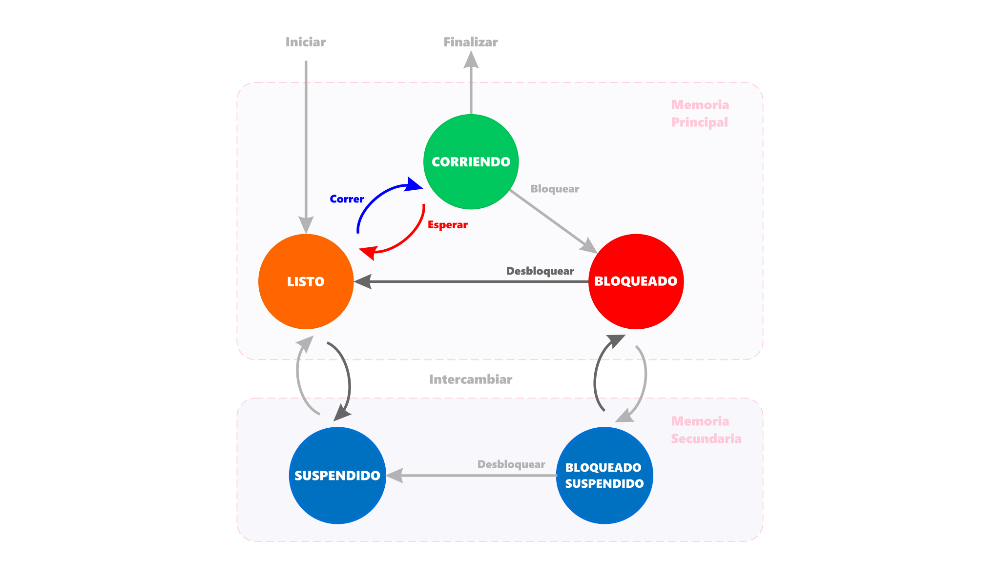
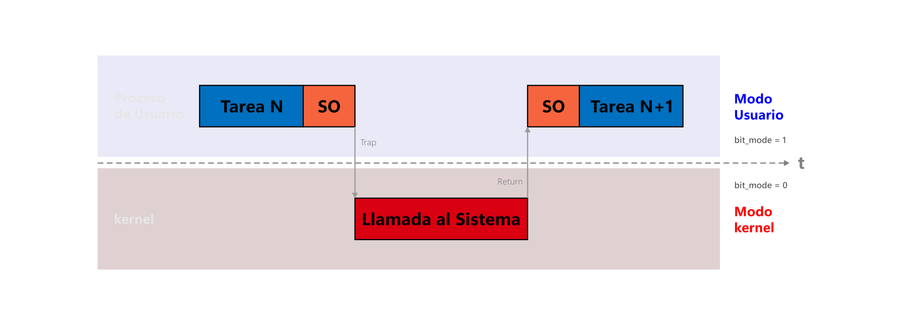
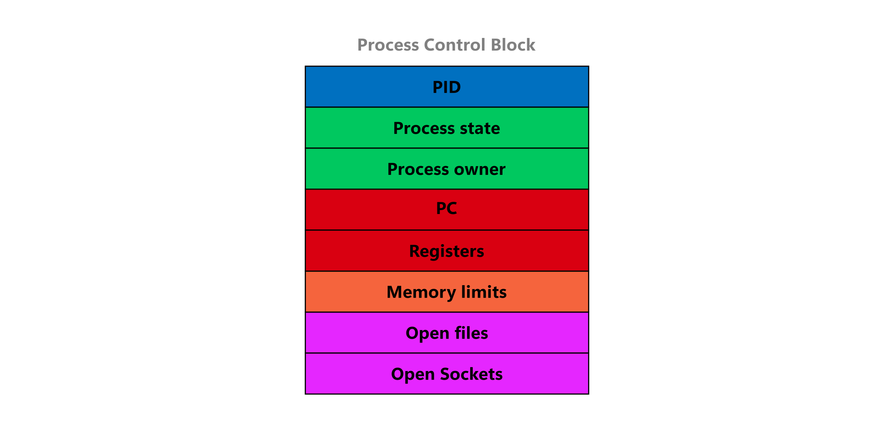

# Sistemas operacionales
<p><code>Fundamentos de sistemas operativos</code></p>
<p>Creado por <code>Giancarlo Ortiz</code> para explicar los fundamentos de los <code>Sistemas operativos</code></p>

## Gestión
La gestión consiste en que el sistema operativo asume responsabilidades sobre los datos y los procesos que sobreviven en un sistema de procesamiento digital.

## Agenda
1. [Los procesos](#1-los-procesos).
1. [Los modos de procesamiento](#2-los-modos-de-procesamiento).
1. [El contexto](#3-el-contexto).
1. [La comunicación entre procesos](#4-la-comunicación-entre-procesos).
1. [El planificador](#5-el-planificador).

<br>

---
# 1. Los procesos
Un [procesos][1_0] en es una tarea en ejecución del sistema operativo que se caracteriza por la realización ordenada de una secuencia de instrucciones, un estado y otros recursos del sistema asociados.

* ><i>"Siempre encuentro a la gente más inteligente que yo. Entonces mi trabajo es asegurarme de que la gente inteligente pueda trabajar junta. Y es que la gente estúpida puede trabajar junta fácilmente, la gente inteligente no."</i><br>
<cite style="display:block; text-align: right">[Jack Ma](https://es.wikipedia.org/wiki/Jack_Ma)</cite>

[1_0]:https://es.wikipedia.org/wiki/Proceso_(inform%C3%A1tica)#


## 1.1. Caracteristicas ✔
* Es el principal concepto en cualquier sistema operativo.
* Los resultados de un proceso pueden ser operaciones [MM][11_1](Datos) o [I/O][11_2].
* Los insumos incluyen recursos de [memoria][11_1], datos e instrucciones.
* Un estado del proceso incluye el [contexto][11_3] de la CPU.
* Cada proceso tiene al menos un [thread][11_4] o hilo de ejecución.
* Los hilos se alternan en un núcleo de CPU de forma [concurrente][11_5], 
* La concurrencia da apariencia de paralelismo (multi-programación).

[11_1]:https://es.wikipedia.org/wiki/Memoria_principal
[11_2]:https://es.wikipedia.org/wiki/Perif%C3%A9rico_de_entrada/salida
[11_3]:https://en.wikipedia.org/wiki/Context_(computing)#
[11_4]:https://es.wikipedia.org/wiki/Hilo_(inform%C3%A1tica)#
[11_5]:https://es.wikipedia.org/wiki/Computaci%C3%B3n_concurrente


## 1.2. Tipos ✔
* [__CPU-bound__][12_1]: Los procesos que contienen un alto uso de procesador 
son llamados CPU-bound o compute-bound.
* [__I/O-bound__][12_2]: Los procesos que realizan muchos accesos a 
operaciones de E/S son llamados I/O-bound.

[12_1]:https://en.wikipedia.org/wiki/CPU-bound
[12_2]:https://en.wikipedia.org/wiki/I/O_bound


## 1.3. Estados de ejecución ✔
* [__Ready__][13_1] o Listo.
* [__Running__][13_1] o Corriendo.
* [__Blocked__][13_1] o Bloqueado.
* [__Suspended__][13_1] o Suspendido.

[13_1]:https://en.wikipedia.org/wiki/Process_state


## 1.4. Transición de estados ✔
* [__Dispatch__][14_1] o Listo a ejecutando.
* [__Interrupt__][14_1] o Ejecutando a listo.
* [__Swap__][14_1] o intercambiar a o desde suspendido.

[14_1]:https://en.wikipedia.org/wiki/Process_state


## 1.5. Diagrama de estados ✔




# 2. Los modos de procesamiento
Los [modos de procesamiento][2_0] son los modos de operación de las CPU de algunas arquitecturas, que establecen ciertas restricciones sobre el tipo y ámbito de las operaciones que pueden llevar a cabo ciertos procesos cuando se encuentran corriendo.

* ><i>"Siempre encuentro a la gente más inteligente que yo. Entonces mi trabajo es asegurarme de que la gente inteligente pueda trabajar junta. Y es que la gente estúpida puede trabajar junta fácilmente, la gente inteligente no."</i><br>
<cite style="display:block; text-align: right">[Jack Ma](https://es.wikipedia.org/wiki/Jack_Ma)</cite>

[2_0]:https://es.wikipedia.org/wiki/Modos_de_operaci%C3%B3n_de_la_unidad_central_de_procesamiento


## 2.1 Modo Usuario ✔
* Protege frente a fallas catastróficas.
* Asegura la ejecución aislada de cada proceso.
* El proceso puede acceder a su propio espacio de direcciones o [VAS][21_1].
* El proceso no puede acceder al espacio de direcciones de otros procesos.
* El proceso no puede acceder al espacio de direcciones del kernel.
* No permite el acceso a los dispositivos I/O.
* No permite la ejecución de instrucciones privilegiadas.

[21_1]:https://en.wikipedia.org/wiki/Virtual_address_space


## 2.2 Modo Kernel ✔
* Los procesos pueden acceder a las direcciones del kernel y de los usuarios.
* Permite el acceso sin restricciones al hardware.
* Permite la ejecución de instrucciones privilegiadas.
* Se puede producir por una [llamada al sistema][22_1].
* Las instrucciones de I/O se ejecutan en modo Kernel.

[22_1]:https://es.wikipedia.org/wiki/Llamada_al_sistema


## 2.3 Diagrama modo dual ✔




# 3. El contexto
El [contexto][3_0] de la CPU esta formado por los valores almacenados en sus registros, incluyendo el contador de programa, los registros de estado y los registros de propósito general.

* ><i>"Siempre encuentro a la gente más inteligente que yo. Entonces mi trabajo es asegurarme de que la gente inteligente pueda trabajar junta. Y es que la gente estúpida puede trabajar junta fácilmente, la gente inteligente no."</i><br>
<cite style="display:block; text-align: right">[Jack Ma](https://es.wikipedia.org/wiki/Jack_Ma)</cite>

[3_0]:https://es.wikipedia.org/wiki/Contexto_(inform%C3%A1tica)#


## 3.1. Bloque descriptor de proceso ✔
* Un proceso esta representado por el [PCB][31_1].
* El PCB es una estructura de datos formada por campos.
* Esta estructura será el operando de las operaciones del [Planificador][31_2].
* El PCB se mantiene en un área de la memoria protegida.
* Puede ocupar desde 32 hasta 1024 bits.

[31_1]:https://es.wikipedia.org/wiki/Bloque_de_control_del_proceso
[31_2]:https://es.wikipedia.org/wiki/Planificador


## 3.2. La estructura del PCB ✔
Cada sistema operativo tiene su propio diseño de BCP, pero usualmente puede contener:

| Identificador de proceso |
| :---: |
| Estado del proceso |
| Datos del propietario |
| Prioridad del proceso |
| Contexto de la CPU | 
| Espacio de direcciones |
| Lista de recursos asignados |
| Estadísticas del proceso |
| ... |


## 3.3. Diagrama del PCB ✔




## 3.4. El contador de programa ✔
* Es un registro especial de la CPU.
* Apunta a la dirección de la proxima instrucción a ejecutarse.
* Cada proceso tiene su [PC][34_1] o program counter.
* El PC se incrementa cuando el proceso esta corriendo.

[34_1]:https://es.wikipedia.org/wiki/Contador_de_programa


## 3.5. Cambio de contexto ✔
* Se llama asi a la tarea de cambiar un proceso por otro en el procesador.
* Sirve para aprovechar los tiempos muertos del procesador.
* Sirve para ejecutar mas de un proceso o concurrencia.


## 3.6. Pasos para el cambio de contexto ✔
1. Salvar el estado del proceso actual en el PCB.
1. Cambiar el estado del proceso que estaba ejecutando al que corresponda.
1. Seleccionar otro programa para ejecutar.
1. Cargar el estado del proceso asignado a la CPU a partir de su PCB.
1. Cambiar el estado del proceso nuevo a corriendo.
1. Ejecutar el programa seleccionado


# 4. La comunicación entre procesos
El [IPC][4_0] es una función básica de los sistemas operativos que permite a los procesos comunicarse entre sí a través de mensajes o espacios de memoria compartida.

* ><i>"Siempre encuentro a la gente más inteligente que yo. Entonces mi trabajo es asegurarme de que la gente inteligente pueda trabajar junta. Y es que la gente estúpida puede trabajar junta fácilmente, la gente inteligente no."</i><br>
<cite style="display:block; text-align: right">[Jack Ma](https://es.wikipedia.org/wiki/Jack_Ma)</cite>

[4_0]:https://es.wikipedia.org/wiki/Comunicaci%C3%B3n_entre_procesos


## 4.1. Tipos de comunicación ✔
* La comunicación puede ser directa o indirecta.
* La comunicación puede ser sincrónica o asíncrona.
* La comunicación puede ser persistente o momentánea.
* La comunicación puede ser bidireccional o unidireccional.


## 4.2. Enfoques ✔
* [__Memoria compartida__][42_1]: típico de núcleos monolíticos.
* [__Pasaje de mensajes__][42_1]: típico de micro-núcleos.

[42_1]:https://es.wikipedia.org/wiki/Comunicaci%C3%B3n_entre_procesos


## 4.3. Tubería ✔
* Consiste en una [cadena de procesos][43_1] conectados en serie.
* La salida de cada elemento de la cadena es la entrada del próximo.
* Permiten la comunicación sincrónica entre procesos.
* Es común el uso de buffer de datos entre elementos consecutivos.

[43_1]:https://es.wikipedia.org/wiki/Tuber%C3%ADa_(inform%C3%A1tica)

```ps
# listar los directorios log
ls -l | grep LOG

# listar los procesos de consola 
ps aux | grep bash | more
```


# 5. El planificador
El [planificador][5_0] es un componente del sistema operativo que elije un proceso entre los que están listos para ser ejecutados.

* ><i>"Siempre encuentro a la gente más inteligente que yo. Entonces mi trabajo es asegurarme de que la gente inteligente pueda trabajar junta. Y es que la gente estúpida puede trabajar junta fácilmente, la gente inteligente no."</i><br>
<cite style="display:block; text-align: right">[Jack Ma](https://es.wikipedia.org/wiki/Jack_Ma)</cite>

[5_0]:https://es.wikipedia.org/wiki/Planificador


## 5.1. Niveles de planificación ✔
Los nombres sugieren la frecuencia relativa con la que se realizan sus funciones:

* [__Long term scheduler__][42_1]: planificador de largo plazo.
* [__Mid term scheduler__][42_1]: planificador de medio plazo o intercambiador.
* [__Short term scheduler__][42_1]: planificador de corto plazo o despachador.


### 5.1.1 Planificador de largo plazo ✔
* Controla el grado de [__multi-programación__][51_1].
* Determina qué programas son admitidos para ejecución.
* Ingresa los procesos a la lista de listos o __Ready__.
* Requiere la adecuada combinación de CPU-bound y I/O-bound.

[51_1]:https://es.wikipedia.org/wiki/Multiprogramaci%C3%B3n


### 5.1.2. Planificador de medio plazo ✔
* Controla la [__memoria virtual__][51_2].
* Determina que procesos intercambiar.
* Mueve procesos entre memoria principal y disco.
* Requiere optimizar el espacio en memoria principal.

[51_2]:https://es.wikipedia.org/wiki/Memoria_virtual


### 5.1.3. Planificador de corto plazo ✔
* Controla el [__cambio de contexto__][51_3].
* Determina el modo de operación de la CPU.
* Carga el contexto almacenado en la PCB.
* Requiere la menor latencia posible.

[51_3]:https://es.wikipedia.org/wiki/Cambio_de_contexto


## 5.2. Tiempos ✔
* [__Arrival time__][42_1] [ _t<sub>a</sub>_ ]: tiempo de arribo.
* [__Burst time__][42_1] [ _t<sub>b</sub>_ ]: tiempo de ráfaga.
* [__Waiting time__][42_1] [ _t<sub>w</sub>_ ]: tiempo de espera.
* [__Response time__][42_1] [ _R<sub>t</sub>_ ]: tiempo de respuesta.
* [__Turnaround time__][42_1] [ _T<sub>t</sub>_ ]: tiempo de retorno.

<p align="center"><i>R<sub>t</sub> = t<sub>a</sub> + t<sub>w</sub></i></p>
<p align="center"><i>T<sub>t</sub> = R<sub>t</sub> + t<sub>b</sub></i></p>


## 5.3. Indicadores ✔
* [__Utilization__][42_1] [ _U_ ]: porcentaje de uso de la unidad de procesamiento.
* [__Throughput__][42_1] [ _T_ ]: número de procesos completados por unidad de tiempo.
* [__Average wait time__][42_1] [ _A_ ]: tiempo promedio de espera.

<p align="center"><i>A = 1/<sub>n</sub> . ∑<sub>n</sub> T<sub>t</sub></i></p>


## 5.4. Políticas de planificación ✔
* [__First Come First Served__][54_1] [ FCFS ]: se ejecuta en el orden que llega a la cola.
* [__Shortest Job First__][54_2] [ SJF ]: se ejecuta el mas corto.
* [__Shortest remaining time__][54_3] [ SRTF ]: se ejecuta el mas corto.
* [__Round Robin__][54_1] [ RR ]: se ejecutan equitativamente por un tiempo estático.
* [__Completely Fair Scheduler__][54_1] [ CFS ]: se ejecutan por un tiempo proporcional.

[54_1]:https://en.wikipedia.org/wiki/FIFO_(computing_and_electronics)#
[54_2]:https://en.wikipedia.org/wiki/Shortest_job_next
[54_3]:https://en.wikipedia.org/wiki/Shortest_remaining_time
[54_4]:https://en.wikipedia.org/wiki/Round-robin_scheduling
[54_5]:https://en.wikipedia.org/wiki/Completely_Fair_Scheduler


## 5.5. Tipos de planificador ✔
* [__Cooperative scheduler__][55_1]: para multi-tarea cooperativa.
* [__Preemptive scheduler__][55_2]: para multi-tarea apropiativa.

[55_1]:https://es.wikipedia.org/wiki/Multitarea_cooperativa
[55_2]:https://es.wikipedia.org/wiki/Multitarea_apropiativa


## 5.6. Tipos de cola ✔
* [__Simple queue__][56_1]: secuencia de elementos donde inserción y extracción se realizan por extremos opuestos.
* [__Priority queue__][56_2]: los elementos de la secuencia ordenada tienen adicionalmente, una prioridad asignada.
* [__Multilevel queue__][56_3]: los elementos de la secuencia se asignan a un nivel predefinido en la inserción.
* [__Multilevel feedback queue__][56_4]: los elementos de la secuencia se cambian de nivel después de la inserción.

[56_1]:https://en.wikipedia.org/wiki/Queue_(abstract_data_type)#
[56_2]:https://en.wikipedia.org/wiki/Priority_queue
[56_3]:https://en.wikipedia.org/wiki/Multilevel_queue
[56_4]:https://en.wikipedia.org/wiki/Multilevel_feedback_queue


---
## Mas Recursos
- [Teoría de colas](https://es.wikipedia.org/wiki/Teor%C3%ADa_de_colas) (Wikipedia)
- [Lottery scheduling](https://en.wikipedia.org/wiki/Lottery_scheduling) (Wikipedia)
- [Stochastic scheduling](https://en.wikipedia.org/wiki/Stochastic_scheduling) (Wikipedia)
