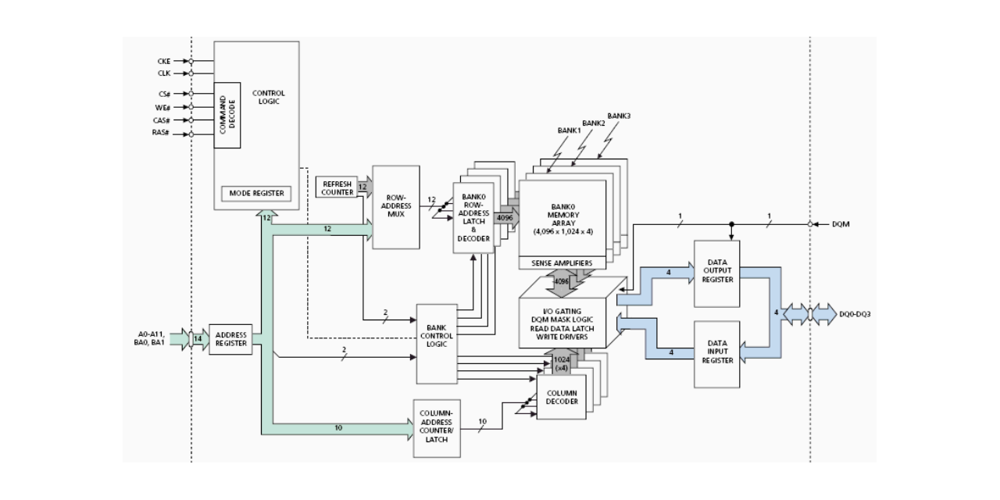
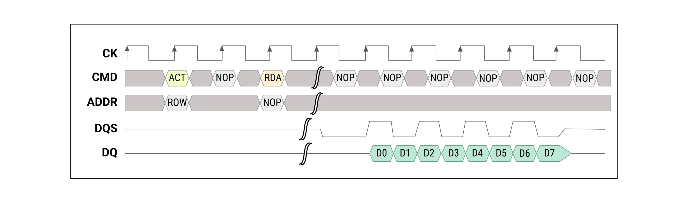
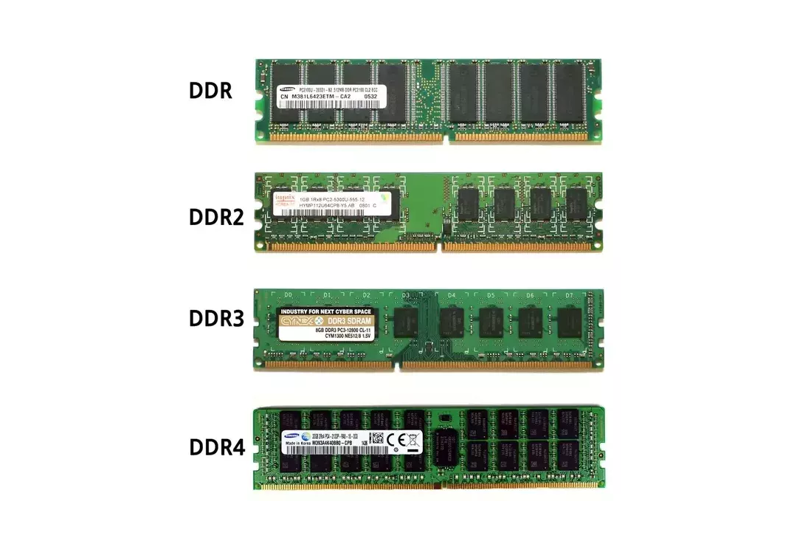
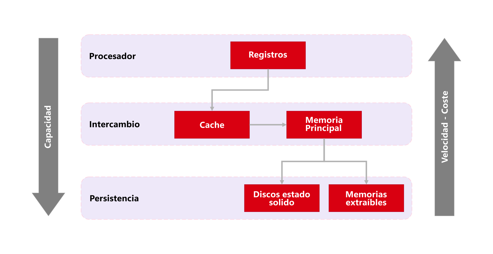
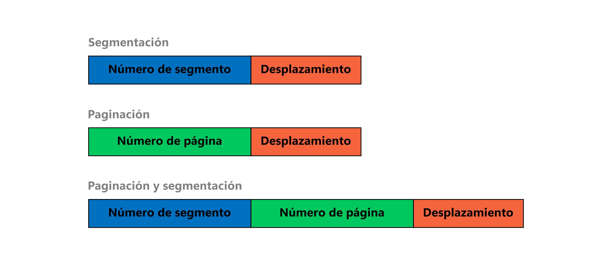
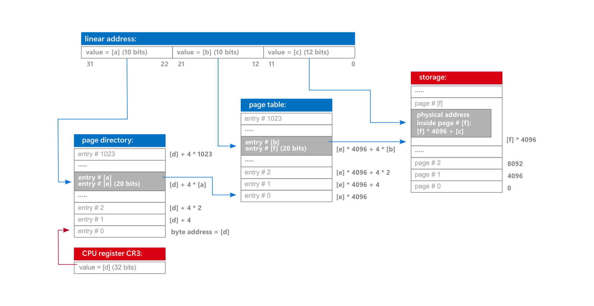

# Sistemas operacionales

<code>Fundamentos de sistemas operativos</code>

Creado por <code>Giancarlo Ortiz</code> para explicar los fundamentos de los <code>Sistemas operativos</code>

## Gestión
La gestión consiste en que el sistema operativo asume responsabilidades sobre los datos y los procesos que sobreviven en un sistema de procesamiento digital.

## Agenda
1. [La memoria principal](#1-la-memoria-principal).
1. [Jerarquía de memoria](#2-jerarquía-de-memoria).
1. [Memoria virtual](#3-memoria-virtual).

 

---
# 1. La memoria principal
La [memoria principal][1_0] es la memoria de la computadora donde se almacenan temporalmente tanto los datos como los programas que la CPU está procesando o va a procesar en un determinado momento.

* ><i>"Siempre encuentro a la gente más inteligente que yo. Entonces mi trabajo es asegurarme de que la gente inteligente pueda trabajar junta. Y es que la gente estúpida puede trabajar junta fácilmente, la gente inteligente no."</i> 
<cite style="display:block; text-align: right">[Jack Ma](https://es.wikipedia.org/wiki/Jack_Ma)</cite>

[1_0]:https://es.wikipedia.org/wiki/Memoria_principal

## 1.1. Caracteristicas ✔
* Almacenamiento de acceso aleatorio.
* Almacenamiento [volátil][11_1].
* Requiere un controlador de memoria complejo ([North-bridge][11_2]).
* Las posiciones de memoria se acceden en ráfaga.
* Su acceso directo representa solo uno de los [modos de direccionamiento][11_3].

[11_1]:https://es.wikipedia.org/wiki/Memoria_vol%C3%A1til
[11_2]:https://es.wikipedia.org/wiki/Puente_norte
[11_3]:https://es.wikipedia.org/wiki/Modo_de_direccionamiento

## 1.2. Capacidad ✔
* La capacidad de memoria es una potencia de dos.
* La capacidad depende de las [lineas de dirección][12_1].
* Las direcciones están agrupadas en chips, grupos, bancos, columnas y filas.
* [Memoria virtual][12_2] si se necesitan más direcciones de las que se puede proporcionar.

[12_1]:https://es.wikipedia.org/wiki/Direcci%C3%B3n_de_memoria
[12_2]:https://es.wikipedia.org/wiki/Memoria_virtual

## 1.3. Tipos de memoria de acceso aleatorio ✔
* Puede ser [estática][13_1] en el caso de la memoria cache.
* Puede ser [dinámica][13_2] en el caso de la memoria principal.
* Puede ser no sincrónica o [sincrónica][13_3].
* La tasa de datos puede ser simple o [doble][13_4].

[13_1]:https://es.wikipedia.org/wiki/SRAM
[13_2]:https://es.wikipedia.org/wiki/DRAM
[13_3]:https://es.wikipedia.org/wiki/SDRAM
[13_4]:https://es.wikipedia.org/wiki/DDR_SDRAM

## 1.4. Organización interna de memoria DDR5 ✔
* [Comandos][14_1] de 14 bits.
* 3 bit de chip son 8 chip.
* 3 bit de grupo son 8 grupos.
* 2 bit de banco son 4 bancos.
* 17 bit de fila son 131.072 filas.
* 7 bit de columna son 128 columnas.

[14_1]:https://en.wikipedia.org/wiki/DDR5_SDRAM#Command_encoding

## 1.5. Operación de memoria DDR5 ✔
* Señal para activar el tablero y esperar activación.
* Señal para activar la fila y esperar activación.
* Señal para activar la columna y esperar activación.
* Señal para pre-cargar o desactivar la activación de fila.

## 1.6. Señales de operación DDR5 ✔
* [Burst length][16_1] = 8/16 bit.
* [Cas Latency][16_2] = 32/40 ciclos.

[16_1]:https://en.wikipedia.org/wiki/CAS_latency
[16_2]:https://en.wikipedia.org/wiki/Dynamic_random-access_memory#Principles_of_operation

## 1.7. frecuencia de operación ✔
* El reloj de [DDR][17_1] es igual a la frecuencia central.
* El reloj de [DDR2][17_2] es 2 veces la frecuencia central.
* El reloj de [DDR3][17_3] es 4 veces la frecuencia central.
* El reloj de [DDR4][17_4] es 8 veces la frecuencia central.
* El reloj de [DDR5][17_5] es 16 veces la frecuencia central.

[17_1]:https://en.wikipedia.org/wiki/DDR_SDRAM
[17_2]:https://en.wikipedia.org/wiki/DDR2_SDRAM
[17_3]:https://en.wikipedia.org/wiki/DDR3_SDRAM
[17_4]:https://en.wikipedia.org/wiki/DDR4_SDRAM
[17_5]:https://en.wikipedia.org/wiki/DDR5_SDRAM

Source: 1:[Rodrigo, A (2021). Memoria RAM DDR, DDR2, DDR3, DDR4 y DDR5, ¿cuáles son sus diferencias?.](https://hardzone.es/tutoriales/componentes/diferencias-memoria-ram-ddr/) 2:[Raikar, A. (2021). DDR Memory and the Challenges in PCB Design](https://www.protoexpress.com/blog/ddr4-vs-ddr5-the-best-ram/)

# 2. Jerarquía de memoria
La [jerarquía de memoria][2_0] es la organización piramidal de la memoria en niveles de acceso para optimizar el rendimiento y el costo basándose en el principio de cercanía de referencias.
tá procesando o va a procesar en un determinado momento.

* ><i>"Siempre encuentro a la gente más inteligente que yo. Entonces mi trabajo es asegurarme de que la gente inteligente pueda trabajar junta. Y es que la gente estúpida puede trabajar junta fácilmente, la gente inteligente no."</i> 
<cite style="display:block; text-align: right">[Jack Ma](https://es.wikipedia.org/wiki/Jack_Ma)</cite>

[2_0]:https://es.wikipedia.org/wiki/Jerarqu%C3%ADa_de_memoria

## 2.1. Capacidad vs Costo ✔

## 2.2. Políticas de Cache ✔
* El cache puede ser inclusivo o exclusivo.
* La ubicación puede ser directa o asociativa.
* La extracción puede ser por demanda o con pre-búsqueda.
* La escritura en cache puede ser asignada antes de la CPU o al tiempo.
* Puede ser de escritura inmediata de MP o Post-escritura.
* La [pila implementada][22_1] puede ser FIFO, LFU o LRU.

[22_1]:https://es.wikipedia.org/wiki/Algoritmo_de_reemplazo_de_p%C3%A1ginas

## 2.3. Niveles de cache ✔
* [Cache L1][23_2]
* [Cache L2][23_2]
* [Cache L3][23_2]

[23_2]:https://en.wikipedia.org/wiki/Cache_hierarchy

## 2.4. Indicadores ✔
* [Miss rate][24_1]: fallos en la caché.
* [Miss penalty][24_1]: penalizaciones por fallo.
* [Hit time][24_1]: tiempo de acceso en caso de acierto.

[24_1]:https://en.wikipedia.org/wiki/Cache_hierarchy

# 3. Memoria virtual
La [memoria virtual][3_0] es una técnica de gestión de la memoria que se encarga de que el sistema operativo disponga una mayor cantidad de memoria de la que esta disponible físicamente.

* ><i>"Siempre encuentro a la gente más inteligente que yo. Entonces mi trabajo es asegurarme de que la gente inteligente pueda trabajar junta. Y es que la gente estúpida puede trabajar junta fácilmente, la gente inteligente no."</i> 
<cite style="display:block; text-align: right">[Jack Ma](https://es.wikipedia.org/wiki/Jack_Ma)</cite>

[3_0]:https://es.wikipedia.org/wiki/Memoria_virtual

## 3.1. Caracteristicas ✔
* Puede ser contigua o [segmentada][31_1].
* Puede ser total o [paginada][31_2] en bloques de tamaño fijo.
* Se puede implementar particiones estáticas o [dinámicas][31_3].
* Se puede implementar el intercambio a memoria secundaria.
* Se puede crear un [direcciones unificadas][31_4] para CPU, GPU y DSP.

[31_1]:https://es.wikipedia.org/wiki/Segmentaci%C3%B3n_de_memoria
[31_2]:https://es.wikipedia.org/wiki/Paginaci%C3%B3n_de_memoria
[31_3]:https://en.wikipedia.org/wiki/Demand_paging
[31_4]:https://en.wikipedia.org/wiki/Heterogeneous_System_Architecture

## 3.2. Técnicas ✔

## 3.3. Paginación de memoria ✔
* Se puede implementar por software o hardware.
* Se puede implementar [paginación anidada][33_1] para SO invitados.
* Puede incluir varios niveles.
* Incluye una [tabla de traducción][33_2] por cada nivel.
* Se puede implementar [cache para el nivel superior][33_3].

[33_1]:https://es.wikipedia.org/wiki/Paginaci%C3%B3n_anidada
[33_2]:https://es.wikipedia.org/wiki/Tabla_de_paginaci%C3%B3n
[33_3]:https://es.wikipedia.org/wiki/Translation_Lookaside_Buffer

## 3.4. Arquitectura iA-32/x86 ✔
* Permite direcciones de 32 bits.
* Permite 232 o hasta 4Giga direcciones.
* Permite 16.383 segmentos de hasta 4GB cada uno.
* Puede permitir direcciones físicas de 36 bits usando [PAE][34_1].
* Hasta tres niveles de paginación.
* Bit de no ejecución o [NX][34_2] por segmento.

[34_1]:https://es.wikipedia.org/wiki/Extensi%C3%B3n_de_direcci%C3%B3n_f%C3%ADsica
[34_2]:https://es.wikipedia.org/wiki/Bit_NX

## 3.5.  Arquitectura x86-64 ✔
* Permite direcciones de 64 bits.
* Permite 264 o hasta 16Exa de direcciones.
* Extensión de 64 bits de x86.
* 16+([9+9+9+9][35_1])+12.
* Hasta cuatro niveles de paginación.
* Bit de no ejecución o [NX][34_2] por pagina.

[35_1]:https://es.wikipedia.org/wiki/Tabla_de_paginaci%C3%B3n#Tabla_de_P%C3%A1ginas_Multinivel

## 3.6. Paginación de dos niveles ✔

## 3.7. Secuencia de pasos de un proceso ✔
1. Asignar espacio de memoria al proceso.
1. Crear el proceso (contexto) en memoria principal.
1. Cargar el contexto almacenado en la PCB.
1. Cambio modo de operación según se requiera.
1. Salto a la instrucción almacenada en el PC.
1. Entrega el control de la CPU al proceso seleccionado.
1. Interrupción por acceso no permitido.
1. Interrupción del proceso por el planificador.

---
## Mas Recursos
- [Unidad de gestión de memoria](https://es.wikipedia.org/wiki/Unidad_de_gesti%C3%B3n_de_memoria) (Wikipedia)
- [Algoritmo de reemplazo de páginas](https://es.wikipedia.org/wiki/Algoritmo_de_reemplazo_de_p%C3%A1ginas) (Wikipedia)
- [Memoria compartida](https://es.wikipedia.org/wiki/Memoria_compartida) (Wikipedia)