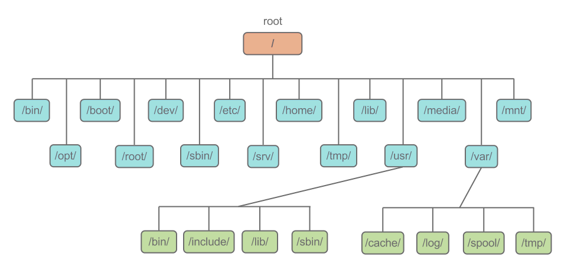

# Sistemas operacionales

<code>Fundamentos de sistemas operativos</code>

Creado por <code>Giancarlo Ortiz</code> para explicar los fundamentos de los <code>Sistemas operativos</code>

## Gestión
La gestión consiste en que el sistema operativo asume responsabilidades sobre los datos y los procesos que sobreviven en un sistema de procesamiento digital.

## Agenda
1. [Los archivos](#1-los-archivos).
1. [Sistema de archivos](#2-sistema-de-archivos).

 

---
# 1. Los Archivos
Un [archivos][1_0] es un conjunto de bits que son almacenados en un dispositivo, con el objetivo persistir o de mantener de forma permanente los datos.

* ><i>"Siempre encuentro a la gente más inteligente que yo. Entonces mi trabajo es asegurarme de que la gente inteligente pueda trabajar junta. Y es que la gente estúpida puede trabajar junta fácilmente, la gente inteligente no."</i> 
<cite style="display:block; text-align: right">[Jack Ma](https://es.wikipedia.org/wiki/Jack_Ma)</cite>

[1_0]:https://es.wikipedia.org/wiki/Virtualizaci%C3%B3n_de_datos

# 2. Sistema de archivos

## / – Root ✔
* Todo archivo o directorio empieza desde el root.
* Solo el usuario Root tiene privilegios de escritura en este directorio.
* No es lo mismo /root que /.

## /bin – Binarios ✔
* Contiene los binarios ejecutables
* Los comandos esenciales como ls o cp generalmente están en esta carpeta
* Pueden ser usados por todos los usuarios del sistema

## /sbin – Binarios del sistema ✔
* Igual que /bin, tiene binarios que son comunes al sistema Linux
* Generalmente son binarios que pertenecen a tareas administrativas
* No todos los usuarios tienen acceso a los binarios de esta carpeta
* Piensa en que son usados por administradores del sistema
    * ejemplo: iptables, reboot, fdisk

## /etc – Archivos de configuración ✔
* Contiene archivos de configuración requerido por los programas
* También tiene archivos para iniciar o detener programas individuales
    * Ejemplo, /etc/resolv.conf

## /dev – Archivos de dispositivos ✔
* Contiene los archivos de los dispositivos instalados
* También incluye terminales, USB o cualquier dispositivo que esté en el sistema
    * Ejemplo: /dev/usbone

## /proc – Información de procesos ✔
* Contiene información sobre los procesos de Linux
* Contiene un pseudo sistema de archivos
* Consiste en /proc/{id_proceso}

## /var – Archivos varios ✔
* Contiene información variable
* Información que se espera que crezca con el tiempo, es encontrado aquí
* Archivos de logs (/var/log)
* Paquetes y base de datos (/var/lib)
* e-mail (/var/mail)
* Archivos temporales (/var/tmp)

## /tmp – Archivos temporales ✔
* Lugar donde se encuentran archivos temporales creados por programas y los usuarios
* Se eliminan en cada reinicio del sistema

## /usr – Rutinas especiales de Linux ✔
* Aunque el nombre puede dar a confusión, no tiene nada que ver con archivos de usuarios
La jerarquía parece como la de root (/)
Contiene binarios, archivos, documentación y recursos de segundo nivel
/usr/bin contiene también binarios, pero son menos usados que los de /bin, por ejemplo: awk, less, scp
/usr/sbin también contiene binarios del sistema que son menos utilizados, cron, sshd, useradd
/usr/local contiene programas que se instalan directamente desde el código fuente

## /home – Directorio de inicio ✔
* Es el directorio de inicio de cada usuario
* Este directorio contiene una carpeta por cada usuario en el sistema que puede iniciar sesión
* Solo los usuarios que pertenecen a sus propias carpetas tienen permisos de escritura, lectura y ejecución (además de root)

## /boot – Archivos de carga ✔
* Contiene los archivos de inicio del kernel
* Por ejemplo, grub está localizado en este directorio
* No encontrarás información de cómo Linux bootea en este directorio

## /lib – Bibliotecas del sistema ✔
* Contiene las bibliotecas que son necesarias para los programas de /bin /sbin
* Generalmente son archivos que contienen ld* o li.so.* en su nombre
    * Ejemplo: ld-2.11.1.so, libncurses.so.5.7

## /opt – Archivos y binarios opcionales
* Contiene software de terceros
* Muchos sistemas no utilizan este directorio

## /mnt – Directorio de carga
* Ideado para que los administradores monten otros sistemas de archivos, como USB, otros Discos Duros

## /media – Dispositivos removibles
* Sirve para montar dispositivos removibles como CD-ROM, Floppy Disk, cintas, etc
* Actualmente muy en desuso, se suele utilizar /mnt

---
## Mas Recursos
- [Emulador](https://es.wikipedia.org/wiki/Emulador) (Wikipedia)
- [Simulador](https://es.wikipedia.org/wiki/Simulador) (Wikipedia)
- [Computación en la nube](https://es.wikipedia.org/wiki/Computaci%C3%B3n_en_la_nube) (Wikipedia)
- [Amazon EC2](https://es.wikipedia.org/wiki/Amazon_EC2) (Wikipedia)
- [Microsoft Azure VM](https://es.wikipedia.org/wiki/Microsoft_Azure) (Wikipedia)
- [Alibaba Cloud ECS](https://en.wikipedia.org/wiki/IBM_Cloud) (Wikipedia)
- [Google Compute Engine](https://en.wikipedia.org/wiki/Google_Compute_Engine) (Wikipedia)
- [IBM Cloud VS](https://en.wikipedia.org/wiki/IBM_Cloud) (Wikipedia)
- [Oracle Cloud VM](https://es.wikipedia.org/wiki/Oracle_Cloud) (Wikipedia)