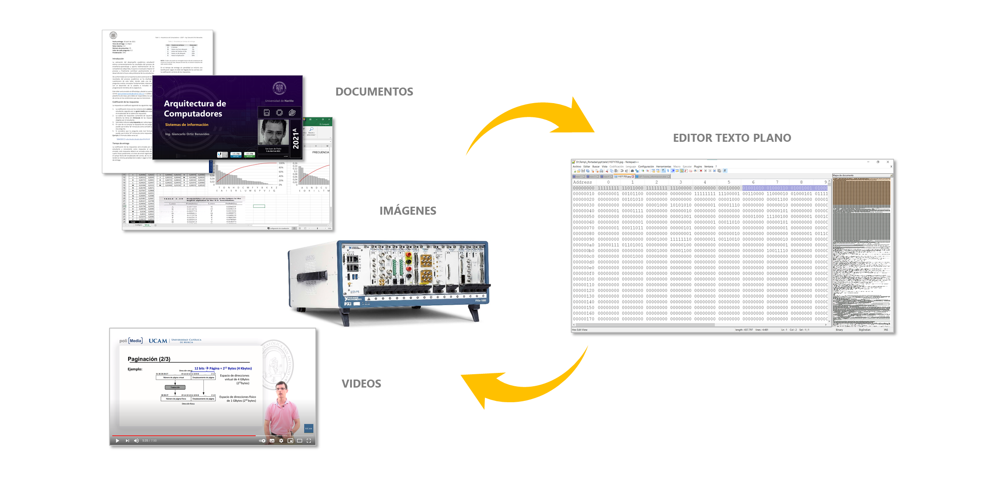

# Sistemas operacionales

<code>Fundamentos de sistemas operativos</code>

Creado por <code>Giancarlo Ortiz</code> para explicar los fundamentos de los <code>Sistemas operativos</code>

## Gestión
La gestión consiste en que el sistema operativo asume responsabilidades sobre los datos y los procesos que sobreviven en un sistema de procesamiento digital.

## Agenda
1. [Los archivos](#1-los-archivos).
1. [Sistema de archivos](#2-sistema-de-archivos).

 

---
# 1. Los Archivos
Un [archivos][1_0] es un conjunto unidimensional de bits que son almacenados en un dispositivo, con el objetivo persistir o de mantener de forma permanente los datos.

* ><i>"Siempre encuentro a la gente más inteligente que yo. Entonces mi trabajo es asegurarme de que la gente inteligente pueda trabajar junta. Y es que la gente estúpida puede trabajar junta fácilmente, la gente inteligente no."</i> 
<cite style="display:block; text-align: right">[Jack Ma](https://es.wikipedia.org/wiki/Jack_Ma)</cite>

[1_0]:https://es.wikipedia.org/wiki/Archivo_(inform%C3%A1tica)#

## 1.1. La Codificación ✔
Se entiende por codificación al proceso de conversión de un sistema de datos de origen a otro sistema de datos de destino.

* Sistema de numeración binaria para datos numéricos.
* Sistema binario para representar datos numéricos y no numéricos.

## 1.2. Representación binaria ✔

## 1.3. La estructura ✔
* Depende del tipo de archivo.
* Depende del sistema operativo.
* Tamaño máximo dependiente del sistema.

## 1.4. Tipos de archivo ✔
* [Archivo de texto plano][14_1].
* [Archivo de programa][14_2].
* [Aplicaciones ejecutables][14_3].
* [Archivo de sistema operativo][14_4].
* [Archivo virtual][14_5].

[14_1]:https://es.wikipedia.org/wiki/Archivo_de_texto
[14_2]:https://en.wikipedia.org/wiki/List_of_file_formats
[14_3]:https://es.wikipedia.org/wiki/Ejecutable
[14_4]:https://es.wikipedia.org/wiki/Biblioteca_(inform%C3%A1tica)#
[14_5]:https://es.wikipedia.org/wiki/Archivo_de_dispositivo

## 1.5. Los formatos ✔
* Metadata ([file signatures][15_1])
* Extensiones ([file formats][15_2])

[15_1]:https://en.wikipedia.org/wiki/List_of_file_signatures
[15_2]:https://en.wikipedia.org/wiki/List_of_file_formats

## 1.6. Ejecutables ✔
Son archivos binarios interpretados por el sistema operativo como programas y su estructura varia según el sistema pero podría incluir un numero mágico, códigos, datos, variables y símbolos de depuración:

## 1.7. Los atributos ✔
* Atributos de seguridad (dueño, contraseña)
* Atributos de protección (permisos de rwx)
* Atributos de tiempo (creación, modificación y acceso)
* Atributos de estado (oculto, bloqueado, temporal)
* Atributos de comprobación (tamaño del registro y archivo)

## 1.8. El nombre ✔
* Incluye nombre del archivo y una o mas extensiones.
* La extension puede ayudar al SO a identificar el tipo.
* Existe un limite para el nombre y la ruta del archivo.

# 2. Sistema de archivos
El [Sistema de archivos][2_0] es un elemento que controla cómo se almacenan y recuperan los datos.

* ><i>"Siempre encuentro a la gente más inteligente que yo. Entonces mi trabajo es asegurarme de que la gente inteligente pueda trabajar junta. Y es que la gente estúpida puede trabajar junta fácilmente, la gente inteligente no."</i> 
<cite style="display:block; text-align: right">[Jack Ma](https://es.wikipedia.org/wiki/Jack_Ma)</cite>

[2_0]:https://es.wikipedia.org/wiki/Sistema_de_archivos

## 2.1. Tipos de sistemas de archivos ✔
* Sistema de archivos de disco.
* Sistemas de archivos de red.

## 2.2. Ejemplos ✔
* NTFS, [New technology file system][22_1]: (windows).
* EXT, [Extended file system][22_2]: (Linux).
* APFS, [Apple File System][22_3]: (macOS).
* exFAT, [Extended File Allocation Table][22_4]: (Medios extraíbles).

[22_1]:https://es.wikipedia.org/wiki/NTFS
[22_2]:https://es.wikipedia.org/wiki/Extended_file_system
[22_3]:https://es.wikipedia.org/wiki/Apple_File_System
[22_4]:https://es.wikipedia.org/wiki/ExFAT

## 2.3. Sistema de archivos linux ✔

### [/][23_0] – Directorio raíz  ✔
* Todo archivo o directorio empieza desde el root.
* Solo el usuario Root tiene privilegios de escritura en este directorio.
* No es lo mismo /root que /.

### [/bin][23_0] – Binarios ✔
* Contiene los binarios ejecutables
* Los comandos esenciales como ls o cp generalmente están en esta carpeta
* Pueden ser usados por todos los usuarios del sistema

## [/sbin][23_0] – Binarios del sistema ✔
* Igual que /bin, tiene binarios que son comunes al sistema Linux
* Generalmente son binarios que pertenecen a tareas administrativas
* No todos los usuarios tienen acceso a los binarios de esta carpeta
* Piensa en que son usados por administradores del sistema
    * ejemplo: iptables, reboot, fdisk

### [/etc][23_0] – Archivos de configuración ✔
* Contiene archivos de configuración requerido por los programas
* También tiene archivos para iniciar o detener programas individuales
    * Ejemplo, /etc/resolv.conf

### [/dev][23_0] – Archivos de dispositivos ✔
* Contiene los archivos de los dispositivos instalados
* También incluye terminales, USB o cualquier dispositivo que esté en el sistema
    * Ejemplo: /dev/usbone

### [/proc][23_0] – Información de procesos ✔
* Contiene información sobre los procesos de Linux
* Contiene un pseudo sistema de archivos
* Consiste en /proc/{id_proceso}

### [/var][23_0] – Archivos varios ✔
* Contiene información variable
* Información que se espera que crezca con el tiempo, es encontrado aquí
* Archivos de logs (/var/log)
* Paquetes y base de datos (/var/lib)
* e-mail (/var/mail)
* Archivos temporales (/var/tmp)

### [/tmp ][23_0] – Archivos temporales ✔
* Lugar donde se encuentran archivos temporales creados por programas y los usuarios
* Se eliminan en cada reinicio del sistema

### [/usr][23_0] – Rutinas especiales de Linux ✔
* Aunque el nombre puede dar a confusión, no tiene nada que ver con archivos de usuarios
La jerarquía parece como la de root (/)
Contiene binarios, archivos, documentación y recursos de segundo nivel
/usr/bin contiene también binarios, pero son menos usados que los de /bin, por ejemplo: awk, less, scp
/usr/sbin también contiene binarios del sistema que son menos utilizados, cron, sshd, useradd
/usr/local contiene programas que se instalan directamente desde el código fuente

### [/home][23_0] – Directorio de inicio ✔
* Es el directorio de inicio de cada usuario
* Este directorio contiene una carpeta por cada usuario en el sistema que puede iniciar sesión
* Solo los usuarios que pertenecen a sus propias carpetas tienen permisos de escritura, lectura y ejecución (además de root)

### [/boot][23_0] – Archivos de carga ✔
* Contiene los archivos de inicio del kernel
* Por ejemplo, grub está localizado en este directorio
* No encontrarás información de cómo Linux bootea en este directorio

### [/lib][23_0] – Bibliotecas del sistema ✔
* Contiene las bibliotecas que son necesarias para los programas de /bin /sbin
* Generalmente son archivos que contienen ld* o li.so.* en su nombre
    * Ejemplo: ld-2.11.1.so, libncurses.so.5.7

### [/opt][23_0] – Archivos y binarios opcionales
* Contiene software de terceros
* Muchos sistemas no utilizan este directorio

### [/mnt][23_0] – Directorio de carga
* Ideado para que los administradores monten otros sistemas de archivos, como USB, otros Discos Duros

### [/media][23_0] – Dispositivos removibles
* Sirve para montar dispositivos removibles como CD-ROM, Floppy Disk, cintas, etc
* Actualmente muy en desuso, se suele utilizar /mnt

[23_0]:https://es.wikipedia.org/wiki/Filesystem_Hierarchy_Standard

---
## Mas Recursos
- [Emulador](https://es.wikipedia.org/wiki/Emulador) (Wikipedia)
- [Simulador](https://es.wikipedia.org/wiki/Simulador) (Wikipedia)
- [Computación en la nube](https://es.wikipedia.org/wiki/Computaci%C3%B3n_en_la_nube) (Wikipedia)
- [Amazon EC2](https://es.wikipedia.org/wiki/Amazon_EC2) (Wikipedia)
- [Microsoft Azure VM](https://es.wikipedia.org/wiki/Microsoft_Azure) (Wikipedia)
- [Alibaba Cloud ECS](https://en.wikipedia.org/wiki/IBM_Cloud) (Wikipedia)
- [Google Compute Engine](https://en.wikipedia.org/wiki/Google_Compute_Engine) (Wikipedia)
- [IBM Cloud VS](https://en.wikipedia.org/wiki/IBM_Cloud) (Wikipedia)
- [Oracle Cloud VM](https://es.wikipedia.org/wiki/Oracle_Cloud) (Wikipedia)